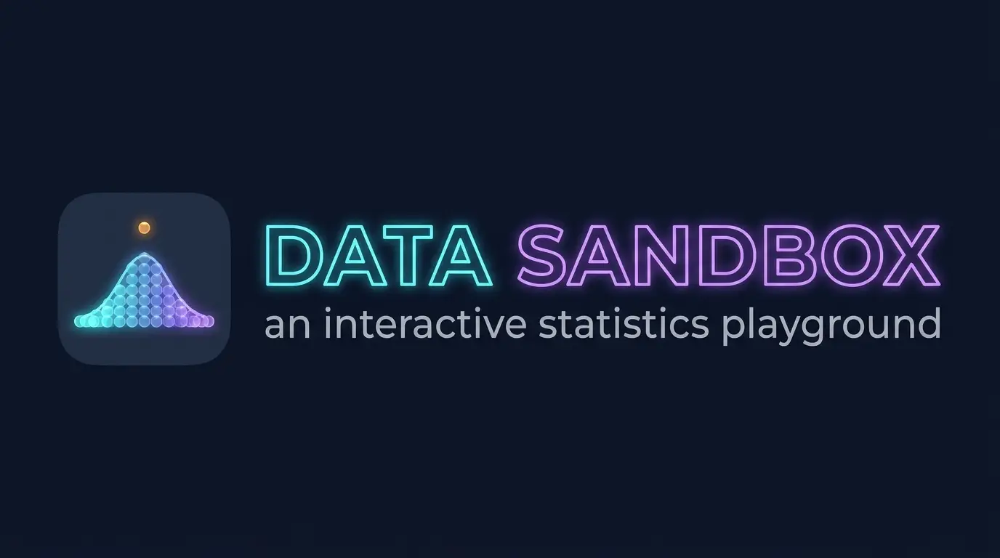
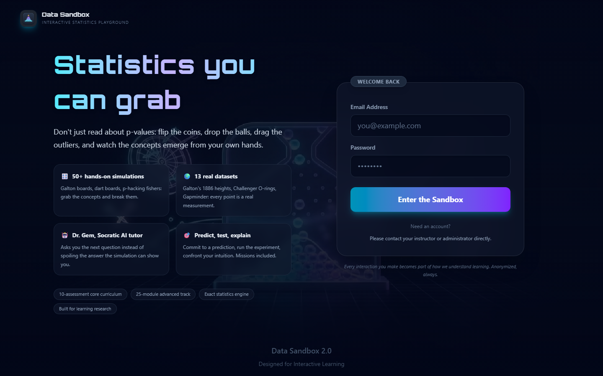
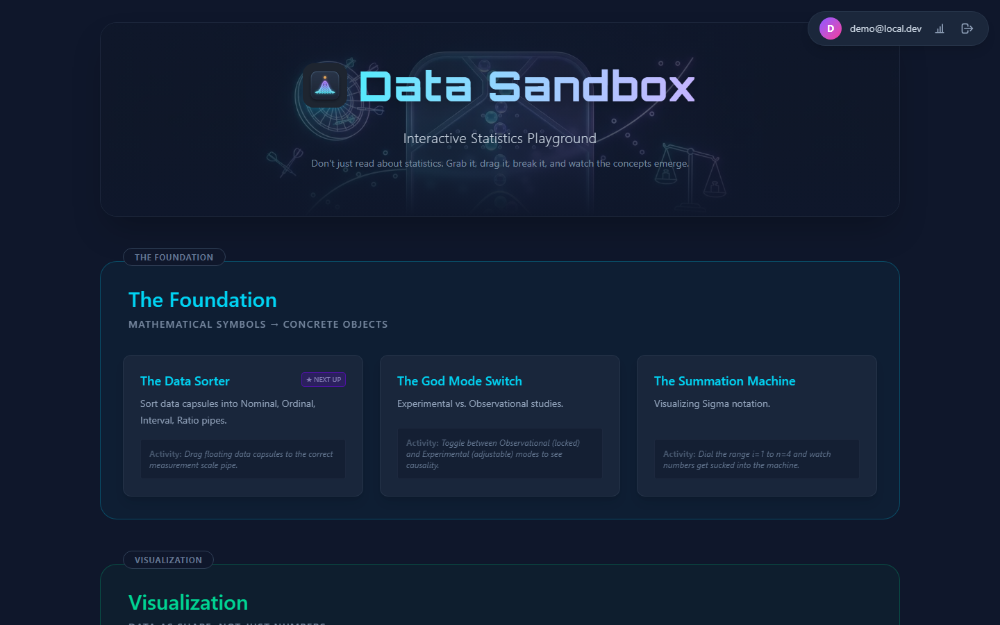
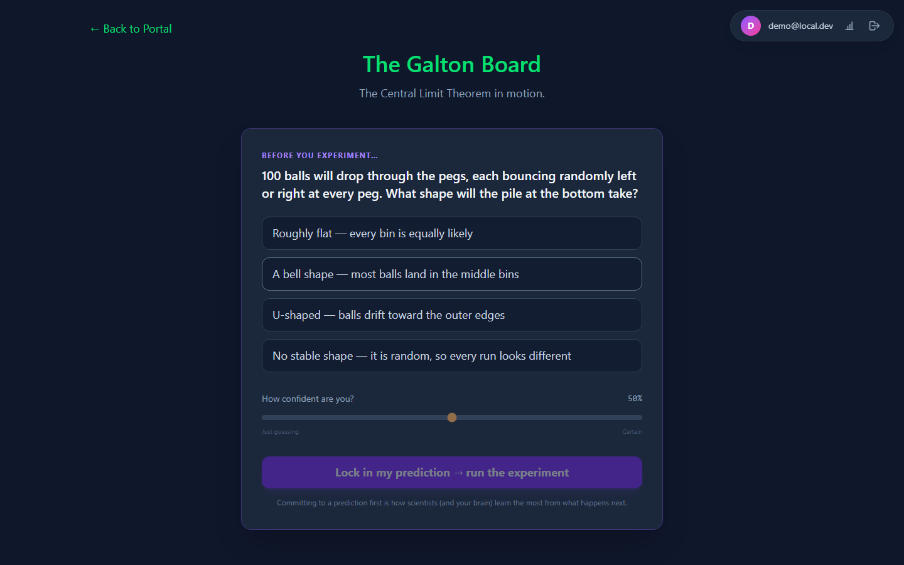
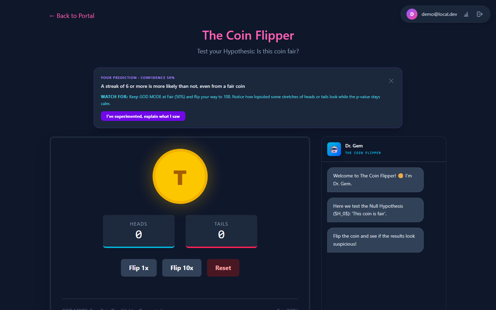
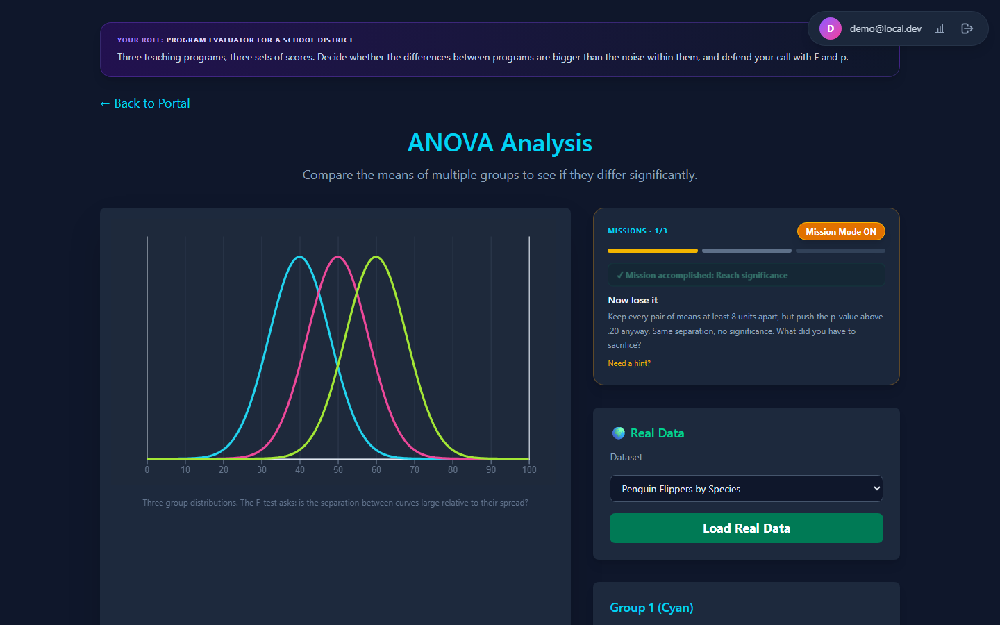
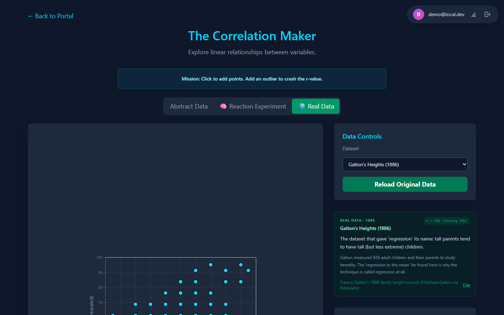
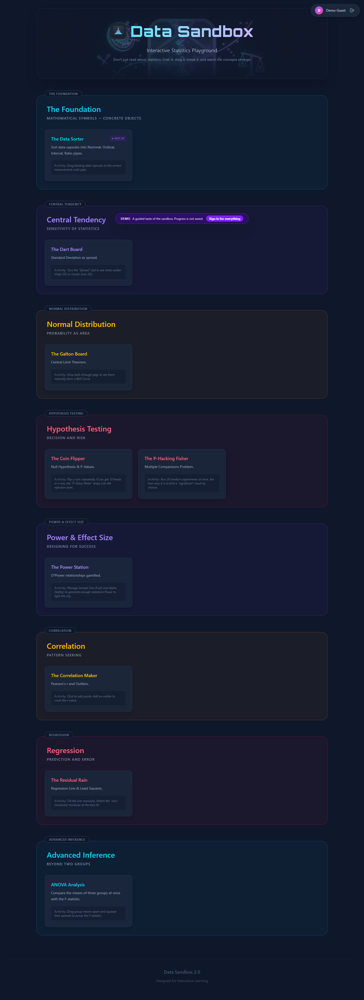
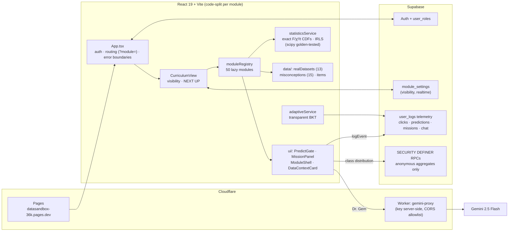

<div align="center">



### Statistics you can grab.

Don't just read about p-values: flip the coins, drop the balls, drag the outliers,
and watch the concepts emerge from your own hands.

**[Live app](https://datasandbox-36k.pages.dev)** ·
**[Try the demo (no account)](https://datasandbox-36k.pages.dev/?demo=1)** ·
**[60-second narrated guide](https://datasandbox-36k.pages.dev/guide/)**




</div>

---

## What is this?

Data Sandbox is a statistics-education platform built around one belief: **concepts stick when
your hands make them happen**. It pairs ~50 manipulable simulations with the design patterns the
statistics-education literature actually validates — predict-observe-explain cycles, real data
with provenance, misconception-targeted feedback, sandbox freedom alongside mission challenge
(Malone & Lepper's intrinsic-motivation taxonomy), and full interaction telemetry so that
learning itself becomes researchable.

<div align="center">

</div>

## Play features

### 🔮 Predict → observe → explain
Flagship modules lock until you commit a prediction **and a confidence judgment**. After you
experiment, the gate reveals whether your intuition held, names the documented misconception it
may have used (15-entry bank anchored in delMas, Hoekstra, Tversky & Kahneman, the ASA p-value
statement…), and shows how your class predicted — anonymously.

<div align="center">


</div>

### 🏆 Sandbox or Mission Mode
Every gamified module offers free play **and** graded missions with live goal tracking
("reach p < .05, now lose it without moving the means, now get it back with n alone").
Confetti, arcade chimes (mutable), and mission telemetry included. Sandbox is always one tap away
— challenge never cancels control.

<div align="center">

</div>

### 🌍 Real data with context and purpose (GAISE Rec 3)
13 classic open datasets — Galton's 1886 heights, the Challenger O-rings, Gapminder, Old
Faithful, Palmer Penguins, Michelson's speed of light, the Titanic manifest… — each with a
provenance card (who collected it, why, citation). Points stay draggable: drag a real measurement
into an outlier position and watch r flinch. Or **upload your own CSV** (parsed entirely
in-browser).

<div align="center">

</div>

### 🤖 Dr. Gem, the Socratic tutor
A Gemini-powered tutor that reads the live module state (slider values, current statistics,
loaded dataset) and follows a Socratic policy: if the simulation can reveal the answer, it points
you to the manipulation instead of spoiling it.

### 📓 A lab notebook that writes itself
Every prediction (with confidence), mission, experiment trial, and question is assembled into a
chronological scientific record with a **JOL calibration readout** (average confidence when right
vs. wrong) and a printable PDF. A transparent **Bayesian Knowledge Tracing** model — the same
`updateMastery` taught in the Knowledge Tracer module — runs on your own telemetry and explains
its next-module suggestion, parameters and all. *The app practices the statistics it teaches.*

### 🧑‍🏫 Built for the classroom
- **Admin dashboard**: per-module visibility & scheduled release, concept×day engagement heatmap,
  module reach analytics.
- **Live Class**: project the anonymous prediction distribution for any gate question while the
  class commits in real time (5s refresh) — a ready-made Peer Instruction flow.
- **Checkpoints**: pre/post conceptual assessment with an explicit research-consent step. Ships
  with original misconception-keyed items; swap in a licensed instrument (CAOS/BLIS) via
  `data/assessmentItems.ts`.
- **Capstone**: students run the full GAISE investigative cycle on data they choose, with
  scope-of-inference guardrails (no causal language without random assignment), ending in a
  printable lab report.

### 🎮 Public demo mode

<div align="center">

</div>

`/?demo=1` opens a curated 9-module guest tour — no account, telemetry tagged `demo-guest`,
progress not persisted. Dev builds expose every module under the same flag (used by the
screencast tooling).

## The curriculum

| Track | Modules | Flavor |
|---|---|---|
| **Core** (10 assessments) | 26 | Foundations → visualization → central tendency → normal distribution → hypothesis testing → t-tests → power & effect size → correlation → regression. Arcade-styled games (Galton Board, Dart Board, P-Hacking Fisher, Power Station…). |
| **Advanced** (5 sections) | 25 | ANOVA, χ², Bayesian updating, multilevel, mixed methods · PSM, RDD, SEM, survival · IRT, factor analysis, BKT · logistic, trees, k-means, PCA, LPA, XAI · HMM, sequence mining, lag-sequential, time series, SNA, LDA, multimodal. Each framed by an endogenous **role scenario** ("program evaluator", "test designer", "accountable-AI officer"). |
| **Research** | 3 | Pre-checkpoint → capstone investigation → post-checkpoint. |

## Architecture



**Key design decisions**

- **Exact statistics, tested.** The engine implements log-gamma, regularized incomplete
  gamma/beta, exact F/χ²/t CDFs, t-based CIs, and Newton-Raphson (IRLS) logistic regression —
  pinned to SciPy/statsmodels golden values by 14 vitest tests. An education app must not teach
  approximate p-values.
- **Telemetry as research infrastructure.** One `user_logs` stream carries clicks, predictions
  (misconception-tagged), missions, tutor turns, assessment responses. Social features only ever
  read **anonymous aggregates** through `SECURITY DEFINER` RPCs.
- **No API keys in the bundle.** Gemini calls go through a Cloudflare Worker
  (`worker/gemini-proxy.js`); dev builds may use a local key, production cannot.
- **Crash isolation.** Every module renders inside an error boundary; a broken simulation reports
  itself to telemetry and never takes down the app.
- **Reproducible content pipelines.** Real datasets (`scripts/build_real_datasets.py`, from
  Rdatasets CSVs committed in-repo) and the narrated guide video
  (`scripts/record_guide.mjs` → `scripts/build_guide_video.py`: Playwright synthetic-cursor
  recording + edge-tts narration + ffmpeg scene alignment) are both one-command rebuilds.

## Project layout

```
App.tsx                  orchestrator: auth, ?module= routing, demo mode, error boundary
curriculum.ts            curriculum data + role scenarios + demo allowlist (single source of truth)
components/
  moduleRegistry.tsx     lazy registry: component key → code-split module
  ui/                    PredictGate, MissionPanel, ModuleShell, Slider, DataContextCard,
                         ClassComparison, ModuleErrorBoundary
  *Analysis.tsx / games  the 50 simulations
  LabNotebookView, ProgressView, AdminDashboard(+Analytics/+LiveClass),
  CapstoneInvestigation, CheckpointAssessment, OnboardingTour, LoginPage
services/
  statisticsService.ts   exact distributions + estimators (+ .test.ts goldens)
  geminiService.ts       Socratic tutor transport (proxy-first)
  loggingService.ts      telemetry pipeline + concept map
  adaptiveService.ts     transparent BKT recommendation
  soundService.ts        synthesized arcade audio (mutable)
data/                    realDatasets (generated), misconceptions, assessmentItems
worker/                  Cloudflare Worker Gemini proxy (+ wrangler.toml)
docs/                    supabase_policies.sql, screenshots, brand
scripts/                 dataset/guide pipelines, Playwright smoke harnesses
public/guide/            narrated tour video + user guide page
```

## Getting started

```bash
npm install
npm run dev          # http://localhost:3000  (try /?demo=1)
npm test             # statistics engine vs scipy golden values
npm run build        # production bundle
```

`.env.local`:

| Variable | Purpose |
|---|---|
| `VITE_SUPABASE_URL` / `VITE_SUPABASE_ANON_KEY` | Supabase project (auth, settings, telemetry) |
| `VITE_GEMINI_PROXY_URL` | Worker proxy URL (production tutor path) |
| `GEMINI_API_KEY` | dev-only direct Gemini fallback (never shipped in prod builds) |

**One-time backend setup:** run `docs/supabase_policies.sql` in the Supabase SQL editor
(idempotent): RLS read policies, the three anonymous-aggregate RPCs, and `module_settings` seeds
for all modules (default hidden; toggle visibility in the admin dashboard).

## Deployment

```bash
# Worker (Gemini proxy)
cd worker && npx wrangler deploy
npx wrangler secret put GEMINI_API_KEY      # paste the server-side key

# Pages
$env:VITE_SUPABASE_URL="..."; $env:VITE_SUPABASE_ANON_KEY="..."
$env:VITE_GEMINI_PROXY_URL="https://datasandbox-gemini-proxy.<acct>.workers.dev"
npm run build
npx wrangler pages deploy dist --project-name datasandbox
```

The worker's `ALLOWED_ORIGINS` var pins CORS to the Pages domain + localhost.

## Research notes

The telemetry design targets statistics-education research (JSDSE-style): prediction commitments
with confidence (JOL) and misconception tags turn clickstreams into conceptual variables;
checkpoints carry an explicit opt-in consent flag for deidentified analysis; class features
expose aggregates only. The assessment item bank is original — replace it with a licensed
validated instrument (CAOS, BLIS, GOALS) for formal studies.

## Acknowledgments & data licenses

Curated datasets are public-domain / CC0 / CC-BY classics redistributed via
[Rdatasets](https://vincentarelbundock.github.io/Rdatasets/) (Galton via HistData; Palmer
Penguins CC0; Gapminder CC-BY; faithful/mtcars/morley/quakes/swiss/Titanic from R `datasets`;
O-rings via DAAG). Misconception anchors and design patterns credit the statistics-education
literature: GAISE College Report (2016), Malone & Lepper (1987), Chance, delMas & Garfield
(2004), delMas & Liu (2005), Hoekstra et al. (2014), Wasserstein & Lazar (2016), Hullman, Resnick
& Adar (2015), Simmons, Nelson & Simonsohn (2011), Corbett & Anderson (1995).

---

<div align="center">
<sub>Data Sandbox 2.0 · Designed for Interactive Learning</sub>
</div>
